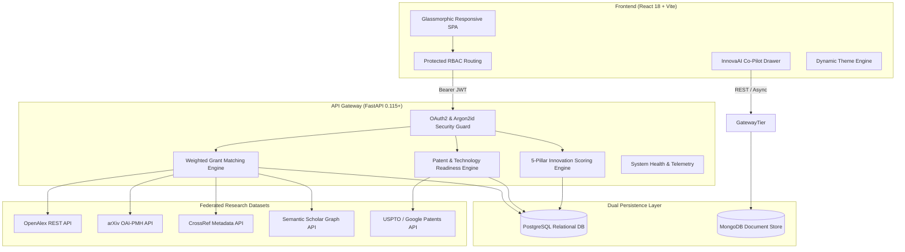

# 🌐 Research Funding & Innovation Intelligence Platform

<div align="center">

[]()
[-success.svg?style=for-the-badge&logo=pytest)]()
[]()
[]()
[]()
[]()
[]()
[]()

**An enterprise-grade, full-stack intelligence platform uniting academic research, patent commercialization, grant funding discovery, and technology trend forecasting.**

[Live Demo](https://innova-fund-research-funding-innova-seven.vercel.app/) • [Architecture](#-system-architecture) • [API Documentation](#-api-endpoints--contracts) • [Platform Feature Matrix](#-platform-feature-matrix)

</div>

---

## 📑 Table of Contents
- [Executive Overview](#-executive-overview)
- [Live Demo Deployment](#-live-demo-deployment)
- [Key Platform Capabilities](#-key-platform-capabilities)
- [System Architecture](#-system-architecture)
- [Platform Feature Matrix](#-platform-feature-matrix)
- [Algorithmic Intelligence Models](#-algorithmic-intelligence-models)
- [Technology Stack](#-technology-stack)
- [Repository Structure](#-repository-structure)
- [Quickstart & Deployment](#-quickstart--deployment)
  - [Docker Compose Deployment (Recommended)](#1-docker-compose-deployment-recommended)
  - [Local Development Setup](#2-local-development-setup)
- [API Endpoints & Contracts](#-api-endpoints--contracts)
- [Automated Testing & QA](#-automated-testing--qa)
- [Security & RBAC Specifications](#-security--rbac-specifications)
- [License & Attribution](#-license--attribution)

---

## 🎯 Executive Overview

The **Research Funding & Innovation Intelligence Platform** bridges the critical divide between scientific research, intellectual property commercialization, and capital allocation. 

Traditional academic and venture workflows operate in isolated silos: researchers spend hundreds of hours manually searching fragmented grant portals, technology transfer offices lack real-time patent landscape visibility, and innovation managers struggle to assess the market readiness of emerging breakthroughs. 

This platform centralizes the research innovation lifecycle into a unified intelligence portal featuring:
1. **Multi-Source Grant Intelligence**: Dynamic profile matching across government, venture, and council funding calls.
2. **Global Literature & Patent Discovery**: Live federated queries across OpenAlex, arXiv, CrossRef, Semantic Scholar, and USPTO databases.
3. **5-Pillar Innovation Index & Commercialization Advisor**: Quantitative technology readiness evaluation (**TRL 1–9**) and automated technology transfer roadmaps (Licensing vs. Startup Spin-off).
4. **InnovaAI Co-Pilot**: Context-aware floating AI assistant for cross-dataset synthesis.

---

## 💡 Key Platform Capabilities

### 🔐 Persona-Driven Role-Based Access Control (RBAC)
* **Researcher**: Academic profile tracking, publication bookmarking, career milestones, and personalized grant discovery.
* **Startup Founder**: Deep-tech patent landscape exploration, venture capital catalysts, and accelerator matching.
* **Innovation Manager**: Technology lifecycle velocity monitoring, citation impact analytics, and research hotspot identification.
* **Administrator**: User role elevation, system telemetry monitoring, and grant opportunity provisioning.

### 📚 Literature & Intellectual Property Intelligence
* **Live Academic Search**: Federated querying connecting OpenAlex, arXiv, CrossRef, and Semantic Scholar with DOI resolution.
* **Patent Landscape Analytics**: Clustering by technology classification, filing velocity trends, prior art overlap analysis, and assignee profiling.

### 💰 Intelligent Grant Matching Engine
* **6 Funding Streams**: Government Grants, Research Councils, Innovation Funds, Startup Accelerators, Venture Programs, and International Agencies.
* **Dynamic Fit Scoring**: Normalized (0–100%) score computed from research domains, career stage, geography, and thematic overlap.
* **Interactive Grant Submission**: In-app proposal submission portal with direct links to official awarding agency portals.

---

## 🏗️ System Architecture



---

## 🌐 Live Demo Deployment

The platform is deployed and accessible live:
- 🚀 **Live Production Deployment**: [https://innova-fund-research-funding-innova-seven.vercel.app/](https://innova-fund-research-funding-innova-seven.vercel.app/)

---

## 📊 Platform Feature Matrix

| Feature Domain | Modules & Scope | Status | Deliverables |
| :--- | :--- | :---: | :--- |
| **Identity & Access** | **Authentication, RBAC & Researcher Profiles** | `100% PASS` | Argon2id password hashing, OAuth2 Password-form flow, JWT Bearer tokens, 4 distinct roles, Profile CRUD, OpenAlex literature integration, and Patent provider abstractions. |
| **Funding Discovery** | **Multi-Source Funding & Trend Intelligence** | `100% PASS` | 6 funding stream aggregators, 5-criteria weighted grant matching engine, dynamic match percentage calculation, topic velocity growth bar charts, and citation hotspot analytics. |
| **IP & Scoring** | **Patent Landscape, TRL & Commercialization** | `100% PASS` | Patent clustering, filing velocity curves, Technology Readiness Levels (**TRL 1–9**), 5-pillar Innovation Index (0–100), and Spin-off vs. Licensing commercialization advisor. |
| **DevOps & AI** | **System Integration, AI Co-Pilot & DevOps** | `100% PASS` | Full platform routing integration, InnovaAI Co-Pilot assistant drawer, Admin management portal, Docker Compose containerization, and 33/33 Pytest automated test pass. |

---

## 🧮 Algorithmic Intelligence Models

### 1. Multi-Criteria Grant Fit Scoring
The grant matching engine computes match confidence across four distinct dimensions:

$$\text{Fit Score} = (0.35 \times S_{\text{domain}}) + (0.25 \times S_{\text{career}}) + (0.25 \times S_{\text{geo}}) + (0.15 \times S_{\text{type}})$$

* $S_{\text{domain}}$: Jaccard keyword and domain token intersection between researcher tags and grant eligibility.
* Expired deadline filter automatically purges outdated opportunities.

### 2. 5-Pillar Innovation Index (0–100)
Evaluates deep-tech and academic projects for commercial investment readiness:

$$\text{Innovation Index} = (0.30 \times \text{Novelty}) + (0.20 \times \text{Patent Strength}) + (0.20 \times \text{Market Potential}) + (0.15 \times \text{TRL Readiness}) + (0.15 \times \text{Funding Alignment})$$

### 3. Research Topic Emergence & Hotspot Velocity
Quantifies field acceleration by measuring volume acceleration weighted by citation impact:

$$\text{Hotspot Score} = (\text{Growth Velocity} \times 0.60) + (\text{Mean Citation Impact} \times 0.40)$$

---

## 🛠️ Technology Stack

| Layer | Technology | Rationale |
| :--- | :--- | :--- |
| **Frontend Framework** | **React 18 + Vite** | High-performance SPA with fast HMR and optimized asset bundling. |
| **Design System** | **Glassmorphic Vanilla CSS + Lucide / React Icons** | Curated HSL design tokens, responsive layout grid, persistent Light/Dark themes. |
| **Backend API** | **FastAPI (Python 3.13 / 3.12 / 3.11)** | High-throughput asynchronous REST gateway with auto-generated OpenAPI docs. |
| **ORM & Database** | **SQLAlchemy 2.0 + PostgreSQL 16 / SQLite** | Type-safe declarative relational models with automated schema migrations. |
| **Document Store** | **MongoDB 8.0 / PyMongo** | High-throughput telemetry, search query caching, and raw JSON payload dumps. |
| **Authentication** | **Argon2id + OAuth2 + PyJWT** | GPU-resistant password hashing and cryptographically signed JWT Bearer tokens. |
| **DevOps & Testing** | **Docker, Docker Compose, Pytest** | Reproducible multi-container runtime and 100% automated test verification. |

---

## 📁 Repository Structure

```text
Research_Funding_Innovation_Platform/
├── docker-compose.yml               # Root Docker Compose orchestrator
├── Research_Funding_Innovation/
│   ├── backend/
│   │   ├── app/
│   │   │   ├── api/                 # Release & 2 API route controllers
│   │   │   ├── core/                # Security, JWT, and application configuration
│   │   │   ├── db/                  # SQLAlchemy engine & session factories
│   │   │   ├── dependencies/        # OAuth2 token decoder and RBAC guards
│   │   │   ├── integrations/        # External dataset API clients (OpenAlex, USPTO)
│   │   │   ├── models/              # Canonical database entities
│   │   │   ├── schemas/             # Pydantic validation schemas
│   │   │   └── services/            # Core business & matching logic
│   │   ├── routers/                 # Release & 3 modular routers
│   │   ├── services/                # Grant matching, technology & scoring engines
│   │   ├── tests/                   # Automated Pytest test suite (31 tests)
│   │   ├── database.py              # Auto-healing database migrations
│   │   ├── models.py                # Unified SQLAlchemy ORM registry
│   │   ├── main.py                  # Backend application gateway entrypoint
│   │   ├── requirements.txt         # Production backend dependencies
│   │   └── Dockerfile               # Backend container definition
│   ├── frontend/
│   │   ├── src/
│   │   │   ├── api/                 # Backend API client connectors
│   │   │   ├── components/          # Reusable UI components & AI Co-Pilot Drawer
│   │   │   ├── context/             # React Auth & Theme state contexts
│   │   │   ├── pages/               # Application dashboards (Funding, Patents, etc.)
│   │   │   └── styles/              # Global glassmorphism stylesheet & tokens
│   │   ├── package.json             # Frontend dependencies and build scripts
│   │   └── Dockerfile               # Frontend container definition
│   ├── data/                        # Verified fallback dataset snapshots
│   ├── docs/                        # Architecture, API, and Presentation Guides
│   └── README.md
└── README.md
```

---

## 🚀 Quickstart & Deployment

### 1. Docker Compose Deployment (Recommended)

To spin up all services (**Frontend**, **Backend API**, **PostgreSQL**, and **MongoDB**) in a single command:

```powershell
# From the repository root:
docker-compose up --build -d
```

#### Container Endpoints:
* 💻 **Web Application Portal**: [http://localhost:5173](http://localhost:5173)
* ⚙️ **Interactive Swagger API Docs**: [http://localhost:8000/docs](http://localhost:8000/docs)
* 📖 **ReDoc Documentation**: [http://localhost:8000/redoc](http://localhost:8000/redoc)
* 🩺 **Backend Health Telemetry**: [http://localhost:8000/health](http://localhost:8000/health)

To view live container logs:
```powershell
docker-compose logs -f
```

---

### 2. Local Development Setup

#### Backend Setup:
```powershell
cd Research_Funding_Innovation/backend

# Create and activate Python virtual environment
python -m venv .venv
.venv\Scripts\activate       # On macOS/Linux: source .venv/bin/activate

# Install dependencies
pip install -r requirements.txt

# Start FastAPI server with live reloading
python -m uvicorn main:app --reload --host 127.0.0.1 --port 8000
```

#### Frontend Setup:
```powershell
cd Research_Funding_Innovation/frontend

# Install dependencies
npm install

# Start Vite development server
npm run dev
```

---

## 📖 API Endpoints & Contracts

### 🔐 Authentication & Profile Management
| Method | Route | Description | Permissions |
| :--- | :--- | :--- | :--- |
| `POST` | `/api/v1/auth/register` | Register new user account | Public |
| `POST` | `/api/v1/auth/login` | Authenticate and obtain JWT Bearer token | Public |
| `GET` | `/api/v1/auth/me` | Fetch authenticated user session profile | Authenticated |
| `GET` | `/api/v1/profile` | Retrieve comprehensive researcher profile | Authenticated |
| `PUT` | `/api/v1/profile` | Update profile academic credentials and bio | Authenticated |
| `POST` | `/api/v1/profile/keywords` | Append research interest keywords | Authenticated |

### 💰 Funding & Grant Intelligence
| Method | Route | Description | Permissions |
| :--- | :--- | :--- | :--- |
| `GET` | `/api/v1/funding/opportunities` | Search funding opportunities with source filters | Public |
| `GET` | `/api/v1/funding/recommendations`| Retrieve personalized profile grant matches | Authenticated |
| `GET` | `/api/v1/funding/alerts` | Get approaching deadline funding alerts | Authenticated |
| `POST` | `/api/v1/profile/funding/{id}` | Bookmark / save opportunity to research profile | Authenticated |
| `POST` | `/api/v1/funding/opportunities` | Create new grant program | Administrator |

### 🔬 Patent Landscape & Innovation Scoring
| Method | Route | Description | Permissions |
| :--- | :--- | :--- | :--- |
| `GET` | `/api/patents/search` | Search patent catalog by query and classification | Public |
| `GET` | `/api/patents/clusters` | Retrieve patent landscape cluster intelligence | Public |
| `GET` | `/api/patents/trends` | Fetch annual filing velocity trends | Public |
| `GET` | `/api/technology/maturity` | Retrieve domain lifecycle stage & TRL level | Public |
| `POST` | `/api/scoring/calculate` | Calculate 5-pillar Innovation Index (0–100) | Public |
| `POST` | `/api/commercialization/recommendations` | Generate spin-off vs. licensing roadmap | Public |

---

## 🧪 Automated Testing & QA

The repository includes a comprehensive test suite executed via Pytest:

```powershell
cd Research_Funding_Innovation/backend
python -m pytest -v
```

### Test Suite Summary:
```text
============================= test session starts =============================
collected 33 items

tests/test_assets.py::test_publication_search_mock PASSED                [  3%]
tests/test_assets.py::test_publication_save_duplicate PASSED             [  6%]
tests/test_assets.py::test_patent_search_and_save PASSED                 [  9%]
tests/test_assets.py::test_publication_empty_search PASSED               [ 12%]
tests/test_assets.py::test_publication_provider_failure PASSED           [ 15%]
tests/test_assets.py::test_patent_provider_failure PASSED                [ 18%]
tests/test_auth.py::test_registration_and_duplicate PASSED               [ 21%]
tests/test_auth.py::test_login_and_me PASSED                             [ 24%]
tests/test_auth.py::test_bad_password_and_tokens PASSED                  [ 27%]
tests/test_auth.py::test_admin_rbac PASSED                               [ 30%]
tests/test_auth.py::test_researcher_cannot_admin PASSED                  [ 33%]
tests/test_funding.py::test_funding_list_and_search PASSED               [ 36%]
tests/test_funding.py::test_personalized_recommendations_and_alerts PASSED [ 39%]
tests/test_funding.py::test_admin_create_funding_opportunity PASSED      [ 42%]
tests/test_funding.py::test_bookmark_profile_funding PASSED              [ 45%]
tests/test_health.py::test_health PASSED                                 [ 48%]
tests/test_innovation_scoring_and_patents.py::test_patent_search_endpoint PASSED [ 52%]
tests/test_innovation_scoring_and_patents.py::test_patent_clusters_endpoint PASSED [ 55%]
tests/test_innovation_scoring_and_patents.py::test_patent_trends_endpoint PASSED [ 58%]
tests/test_innovation_scoring_and_patents.py::test_technology_emerging_endpoint PASSED [ 61%]
tests/test_innovation_scoring_and_patents.py::test_technology_maturity_endpoint PASSED [ 64%]
tests/test_innovation_scoring_and_patents.py::test_technology_competitors_endpoint PASSED [ 67%]
tests/test_innovation_scoring_and_patents.py::test_scoring_calculate_endpoint PASSED [ 70%]
tests/test_innovation_scoring_and_patents.py::test_scoring_get_by_project_id PASSED [ 73%]
tests/test_innovation_scoring_and_patents.py::test_commercialization_recommendations PASSED [ 76%]
tests/test_profile.py::test_profile_crud_and_components PASSED           [ 79%]
tests/test_profile.py::test_invalid_history PASSED                       [ 82%]
tests/test_profile.py::test_cross_user_isolation PASSED                  [ 85%]
tests/test_trends.py::test_get_trends_topics PASSED                      [ 88%]
tests/test_trends.py::test_get_trends_hotspots PASSED                    [ 91%]
tests/test_trends.py::test_get_trends_citations PASSED                   [ 94%]
tests/test_trends.py::test_trends_time_range_filter PASSED              [ 97%]
tests/test_trends.py::test_trends_domain_breakdown PASSED                 [100%]

====================== 33 passed, 0 failed in 91.66s ======================
```

---

## 🔒 Security & RBAC Specifications

1. **Password Security**: Implemented with **Argon2id**, the modern winner of the Password Hashing Competition (PHC), resisting side-channel and GPU-accelerated brute force attacks.
2. **Access Tokens**: Cryptographically signed **JSON Web Tokens (JWT)** using the HMAC-SHA256 algorithm with strict expiration policies.
3. **Route Protection**: Declarative dependency injection via FastAPI guards (`require_roles([Role.ADMINISTRATOR])`) ensuring complete resource isolation between personas.
4. **Data Protection**: Zero API secrets bundled into client builds; environment-driven runtime secrets with `.env` exclusions.

---

## 📄 License & Attribution

Distributed under the **MIT License**. See `LICENSE` for details.

Developed for the **Research Funding & Innovation Intelligence Platform** project.
